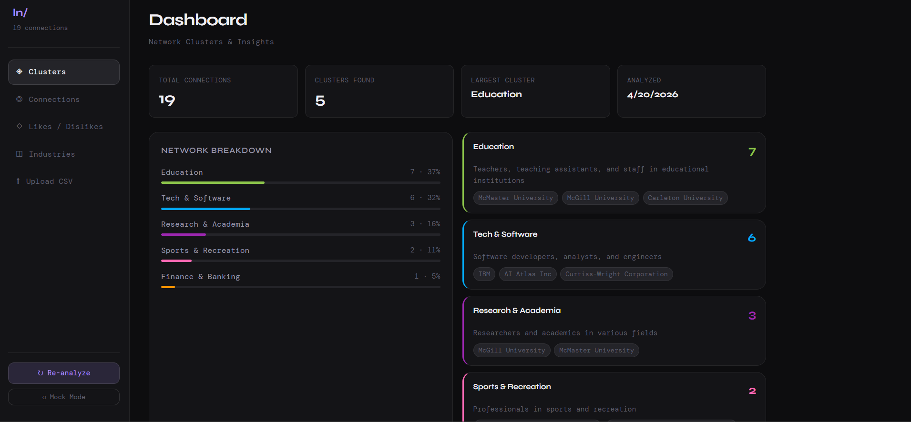
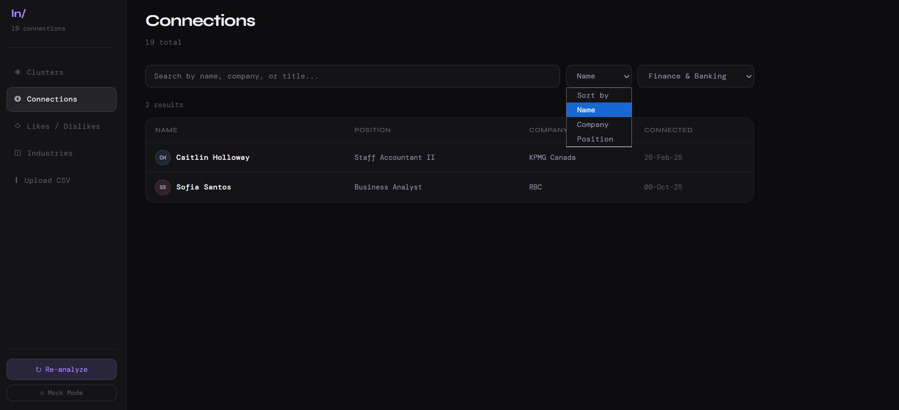
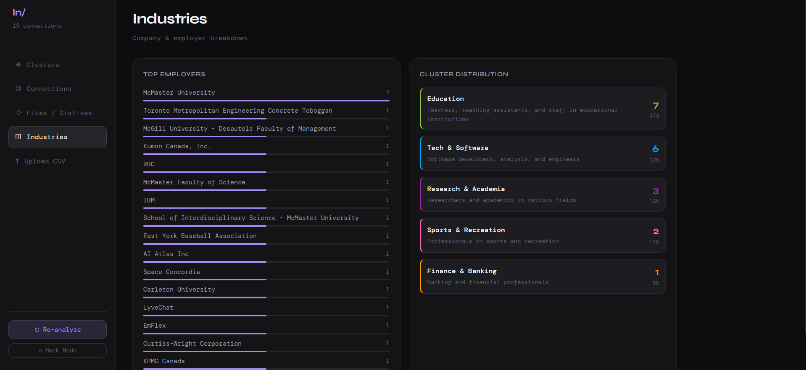
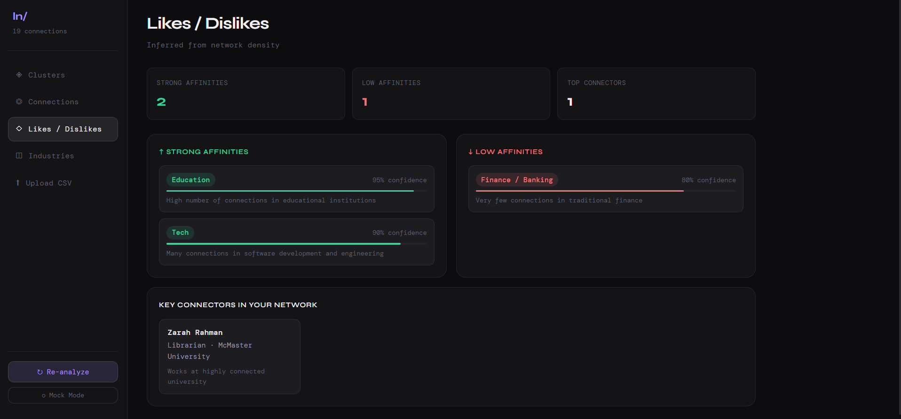

# LinkedIn Network Analyzer - Visualization

A full-stack web application that visualizes and analyzes LinkedIn connections using interactive dashboards and AI-driven insights.

---

## 📊 Main Dashboard



## 🤝 Connections & Filters



## 🏢 Industry Breakdown



## 🎯 Preferences & Insights



## ⚙️ Features
- Visualize LinkedIn connections in an interactive dashboard  
- Filter and segment connections by attributes (industry, role, etc.)  
- AI-powered clustering of user preferences and behaviors  
- Data-driven insights for networking and career analysis  

---

## 🛠️ Tech Stack
- Frontend: HTML, CSS, JavaScript (React/Vite)  
- Backend: Node.js, Express  
- Database: SQL  
- AI Integration: Groq API (for clustering & analysis)  

---

## 🚀 Notes
This project uses sample and personal data for demonstration purposes.
## Quick Start

### 1. Download

```bash
git clone <your-repo>
cd linkedin-dashboard
npm run install:all
```

### 2. Create API Key

Get a free API key from [Groq Console](https://console.groq.com):

```bash
# Create server/.env file:
GROQ_API_KEY=your_key_here
PORT=3001
```

### 3. Run

```bash
npm run dev
```

- Open http://localhost:3001 in your browser

## Features

- **Clusters**: AI-grouped connections by industry/role
- **Connections**: Searchable list of all your connections
- **Likes/Dislikes**: Inferred professional affinities
- **Upload**: Upload your own LinkedIn Connections.csv

## Data

Place your LinkedIn export in `server/data/Connections.csv`, or use the built-in test data.
